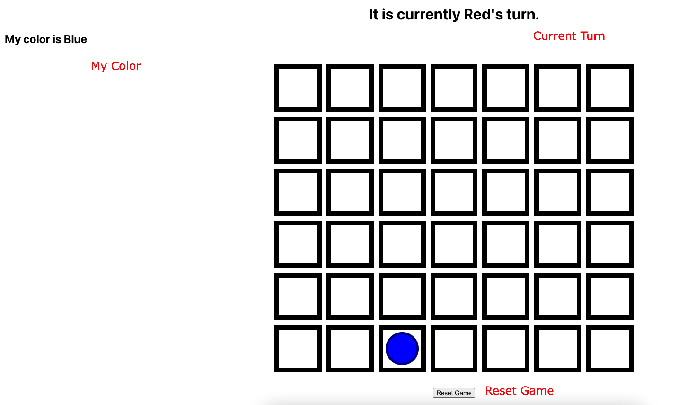

# ConnectFour Game

## How to run

### Project directories

- [frontend-ts](./frontend-ts/)
- [backend-ts](./backend-ts/)

### Stpes to run on local

```bash
$ git clone git@github.com:prettytd/connect4-socket-game.git && cd connect4-socket-game
```

Open 2 terminals in the project root folder

On the first terminal

```bash
$ cd frontend-ts
$ yarn && yarn start
```

On the second terminal

```bash
$ cd backend-ts
$ yarn && yarn start
```

## Play

Open 2 browsers(tabs) and navigate to http://localhost:3000

The page will show

- Current Turn
- My Color
- Board
- Reset Game button



### First player

First joined/start player is always Blue. The second is Red.

Now play!

## Documentation

### Real-time communication

[socket.io-client](https://www.npmjs.com/package/socket.io-client) on React and [socket.io](https://www.npmjs.com/package/socket.io) on Node have been used for real-time communication between client/server.
